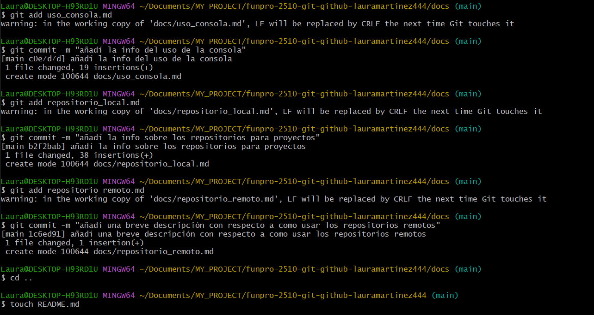

# Crear un directorio:
**Comando: mkdir mi_proyecto**
Descripción: Crea un nuevo directorio llamado "mi_proyecto" donde se almacenará tu proyecto.

## Navegar al directorio:
**Comando: cd mi_proyecto**
Descripción: Cambia el directorio de trabajo actual al nuevo directorio creado.

### Inicializar el repositorio:
**Comando: git init**
Descripción: Inicializa un nuevo repositorio Git en el directorio actual, creando una carpeta oculta llamada .git que almacena toda la información del repositorio.
Comprobación del Estado del Repositorio

#### Ver el estado del repositorio:
**Comando: git status**
Descripción: Muestra el estado actual del directorio de trabajo y del área de preparación (staging area). Indica si hay archivos sin seguimiento, cambios pendientes o si todo está limpio.
Manejo de Archivos

##### Agregar archivos al área de preparación:
**Comando: git add f1.txt**
Descripción: Añade el archivo f1.txt al área de preparación, indicando que este archivo debe ser incluido en el próximo commit.

###### Tomar un commit (guardar cambios):
**Comando: git commit -m "mensaje"**
Descripción: Toma una "foto" del estado actual del proyecto y guarda los cambios en el historial del repositorio con un mensaje descriptivo.

###### Ver el historial de commits:
**Comando: git log**
Descripción: Muestra una lista de todos los commits realizados en el repositorio, incluyendo información sobre cada commit como el autor, la fecha y el mensaje.

###### Modificación y Deshacer Cambios
**Modificar archivos y verificar cambios no preparados:**
Después de modificar un archivo, puedes usar git status para ver que hay cambios no preparados para el commit.

###### Restaurar archivos a su estado anterior:
**Comando: git restore f1.txt**
Descripción: Revierte los cambios realizados en f1.txt, devolviéndolo a su última versión confirmada (commit).

###### Ramas y Colaboración
**Crear y trabajar con ramas:**
Las ramas permiten experimentar con nuevas características sin afectar la rama principal (main). Puedes crear una nueva rama, realizar cambios y luego fusionarla de nuevo a la rama principal cuando estés listo.

###### Fusionar ramas:
Una vez que hayas terminado de trabajar en una rama, puedes fusionarla con la rama principal usando comandos como git merge.

###### Volver a Versiones Anteriores
**Cambiar a un commit anterior:**
Comando: git checkout <commit_hash>
Descripción: Permite navegar a una versión anterior del proyecto utilizando el hash del commit correspondiente.
