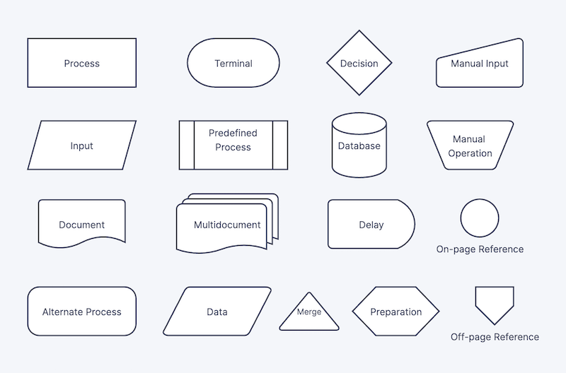

# ¿Qué es un computador?   🖥️💻
*Un computador, también conocido como computadora u ordenador, es una máquina programable y compleja que procesa y ejecuta órdenes para realizar diversas tareas Es un dispositivo electrónico que recibe datos (como números, texto o imágenes), los procesa mediante un conjunto de instrucciones (un programa) y los transforma en información útil.*

🖥️🖥️🖥️🖥️🖥️

## **Partes de un computador**
Un computador se compone de dos partes esenciales: 
*hardware y software*
Hardware El hardware se refiere a los componentes físicos y tangibles de un computador, como el teclado, el ratón, la pantalla, los cables y las placas. Los componentes de hardware se pueden clasificar en internos y externos 
**Componentes internos:**
*Procesador (CPU):* Ejecuta instrucciones de programas y procesa datos También se le conoce como el "cerebro" del computador. La CPU consta de la Unidad Aritmético Lógica (ALU), la Unidad de Control (UC) y registros
*Memoria (RAM y ROM):* La memoria RAM (Random Access Memory) almacena datos a corto plazo y las instrucciones que se están ejecutando. La memoria ROM (Read-Only Memory) es un medio de almacenamiento que solo permite la lectura de información
*Placa madre:* Es una tarjeta de circuito impreso a la que se conectan los componentes del computador 
*ALU (Unidad Aritmético-Lógica):*
Realiza operaciones lógicas, matemáticas o formales que sostienen el sistema 
*Unidad de Control (UC):*
Coordina y controla el flujo de datos dentro del sistema 
*Registros:*
Espacios de almacenamiento de alta velocidad dentro de la CPU que se utilizan para guardar datos e instrucciones que se están utilizando activamente 
*Buses:*
Sistemas de comunicación que transfieren datos entre los componentes del computador 

#### 🖱️🖱️ ⌨️⌨️ **Componentes externos:** 🖱️🖱️ ⌨️⌨️

*Periféricos de entrada:* 
Permiten el ingreso de datos al computador (ej. teclado, ratón) 
*Periféricos de salida:* 
Muestran la información procesada al usuario (ej. monitor, impresora) 
*Dispositivos de almacenamiento:* 
Discos que almacenan información, incluyendo el sistema operativo, programas y archivos del usuario 

### **Componentes internos** 

*Software:* El software es el conjunto de programas, sistemas operativos y funciones instaladas en el computador que coordinan el hardware para funcionar  Incluye el sistema operativo (SO) y las aplicaciones.
*Sistema operativo:* Actúa como una interfaz entre el hardware y las aplicaciones, coordinando el acceso a los recursos del computador 
*Aplicaciones:* Programas que realizan tareas específicas, como edición de textos, reproducción de música o navegación web 
*Software de desarrollo:* Herramientas utilizadas para crear, probar y depurar otros programas (ej. compiladores, entornos de desarrollo integrados (IDEs)) 

### **Funcionamiento general de un computador**
Un computador funciona recibiendo datos de entrada a través de periféricos, procesándolos en la CPU mediante la ejecución de programas (software) almacenados en la memoria, y enviando la información resultante a través de los periféricos de salida La CPU, que incluye la ALU y la Unidad de Control, es responsable de realizar operaciones lógicas y aritméticas y de coordinar el flujo de datos dentro del sistema. 
El sistema operativo gestiona los recursos del hardware y permite que las aplicaciones interactúen con el computador.

🏗️🏗️ **Arquitecturas de un computador:**

La arquitectura de un computador se refiere a su diseño conceptual y la estructura operacional fundamental de un sistema de computación 
Describe cómo están interconectados sus componentes de hardware y cómo interactúan para ejecutar programas.

**Arquitectura CISC (Complex Instruction Set Computing):** 
CISC se caracteriza por un conjunto de instrucciones amplio y complejo, diseñado para realizar tareas complejas con pocas instrucciones. Los computadores con arquitectura CISC, como los procesadores Intel x86, se encuentran comúnmente en equipos de escritorio y portátiles modernos
Arquitectura RISC (Reduced Instruction Set Computing): RISC utiliza un conjunto de instrucciones más pequeño y simple, lo que permite una ejecución más rápida de cada instrucción. Esta arquitectura se encuentra en dispositivos móviles, servidores y sistemas integrados, como los procesadores ARM.

**Registros:**

*Caché:* Memoria de alta velocidad utilizada para almacenar datos a los que se accede con frecuencia, lo que acelera el acceso a la información.

*Principal (RAM):* Almacena datos e instrucciones que la CPU está utilizando actualmente. Es de acceso aleatorio y volátil, lo que significa que los datos se pierden cuando se apaga el computador.

*Secundaria (Disco duro y unidades externas de almacenamiento):* 
Almacena datos a largo plazo, incluyendo el sistema operativo, programas y archivos del usuario. Es no volátil, lo que significa que los datos se conservan cuando se apaga el computador.

**Dispositivos de entrada/salida:**
*Entrada:* Permiten el ingreso de datos al computador (ej. teclado, ratón) 

*Salida:* 
Muestran la información procesada al usuario (ej. monitor, impresora) s

**¿Qué sucede desde que ingreso un dato a través del teclado, hasta que veo el resultado de la operación en la pantalla?** 
Cuando se ingresa un dato a través del teclado, la señal se envía a la CPU, donde se procesa según las instrucciones del programa en ejecución. Luego, el resultado se envía a la tarjeta de video, que lo muestra en la pantalla 
¿Cómo se codifican los datos internamente en el computador? Los datos se codifican internamente en el computador utilizando el sistema binario, que representa la información mediante combinaciones de 0 y 1.

**¿Cuáles son las unidades de medida de datos en un computador?**
*Bit:* La unidad más pequeña de información, que representa un 0 o un 1.

-*Byte:* Un grupo de 8 bits.

-*Kilobyte (KB):* 1024 bytes.

-*Megabyte (MB):* 1024 kilobytes.

-*Gigabyte (GB):* 1024 megabytes.

-*Terabyte (TB):* 1024 gigabytes.

*REFERENCIAS:*
1. https://concepto.de/computador/
2. https://courses.minnalearn.com/es/courses/digital-revolution/the-computing-revolution/computer-basics/ 
3. https://es.wikipedia.org/wiki/Computadora
4. https://concepto.de/computadora/
